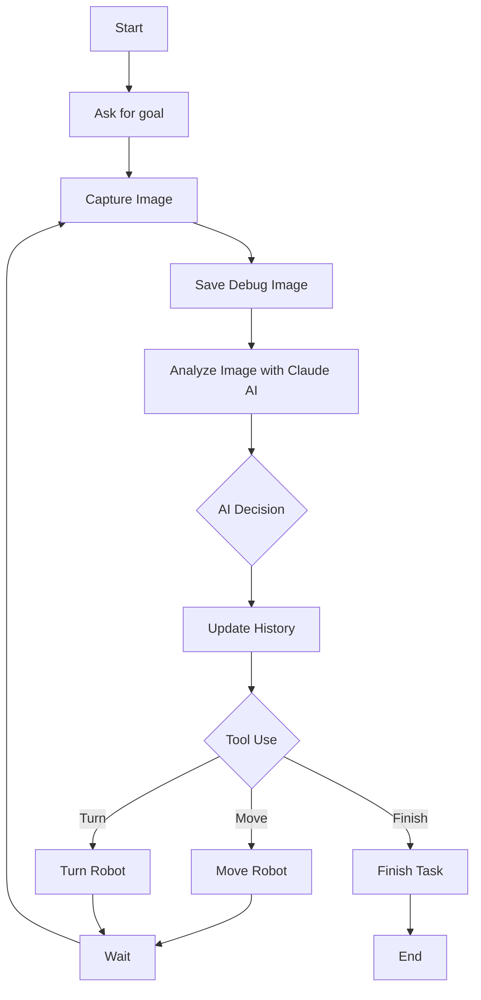

# LLM Decision Making Workshop

This project demonstrates an AI-powered robot control system using Anthropic's Claude API for image analysis and decision-making.

## Features

- Captures images from a camera
- Analyzes images using Claude AI
- Makes decisions for robot movement based on AI analysis
- Supports custom goals for the robot
- Saves debug images for each run

## Prerequisites

- Python 3.12+
- Poetry for dependency management
- Anthropic API key
- Webcam or camera connected to your computer

## Installation

1. Install [Python 3.12+](https://www.python.org/downloads/)
2. Install [Poetry](https://python-poetry.org/docs/#installation)
3. Clone the repository:

   ```bash
   git clone https://github.com/ntindle/llm-decision-making-workshop.git
   cd llm-decision-making-workshop
   ```

4. Install dependencies using Poetry:

   ```bash
   poetry install
   ```

5. Copy the `.env.example` file to `.env` and add your Anthropic API key:

   ```bash
   cp .env.example .env
   ```

   Then edit the `.env` file and replace `<your_anthropic_api_key>` with your actual API key.

## Usage

1. Activate the Poetry environment:

   ```bash
   poetry shell
   ```

2. Run the main script:

   ```bash
   python llm_workshop/main.py
   ```

3. Enter a goal for the robot when prompted (e.g., "go to the kitchen").

4. The program will start capturing images from your camera, analyzing them with Claude AI, and making decisions for robot movement.

5. Debug images will be saved in the `debug` folder for each run.

6. The program will continue running until the AI decides the task is complete or you manually stop it (Ctrl+C).

## Customization

- Modify the `tools` list in `llm_workshop/main.py` to add or change available robot actions.
- Adjust the camera settings or image processing in the `capture_image_from_camera()` function if needed.
- Change the Claude model or other API parameters in the `analyze_image()` function.

## Troubleshooting

- If you encounter camera-related issues, make sure your webcam is properly connected and recognized by your system.
- Check your Anthropic API key if you experience authentication errors.
- Ensure you have sufficient API credits for running multiple iterations of image analysis.

## Contributing

Contributions are welcome! Please feel free to submit a Pull Request.

## License

This project is licensed under the GNU GPLv3 License - see the LICENSE file for details.

## How the Agent System Works

This workshop demonstrates a simple yet powerful AI-driven agent system. Here's an overview of how it functions:

1. **Image Capture**: The system continuously captures images from the camera using OpenCV (`cv2`).

2. **Image Analysis**: Each captured image is sent to the Claude AI model along with the current goal and history.

3. **Decision Making**: Claude analyzes the image and makes decisions based on:
   - The current visual input (image)
   - The given goal
   - The history of previous actions and observations

4. **Action Execution**: The AI chooses an action using predefined tools:
   - `move_robot`: Move forward or backward
   - `turn_robot`: Rotate the robot
   - `finish_task`: Complete the current goal

5. **Feedback Loop**: The system updates its history with the AI's analysis and chosen action, then captures a new image to start the cycle again.

6. **History Management**: The system maintains a history of interactions and decisions:
   - After each analysis, the AI's response (including text output and tool use) is added to the history.
   - This history is passed to the AI in subsequent iterations, allowing it to consider past actions and observations.
   - The `history` variable grows with each iteration, providing context for future decisions.

Key Components:

- `capture_image_from_camera()`: Captures and processes images from the webcam.
- `analyze_image()`: Sends the image to Claude AI and interprets the response.
- `main()`: Orchestrates the entire process in a continuous loop.
- `history`: A list that accumulates the AI's responses and actions over time, providing context for decision-making.

The history plays a crucial role in the agent's decision-making process:
- It allows the AI to remember and learn from past actions and observations.
- The AI can use this information to make more informed decisions, avoiding repetition and building on previous knowledge.
- As the history grows, the AI's understanding of the environment and its progress towards the goal becomes more comprehensive.

By examining the history, you can trace the AI's decision-making process and see how it adapts its strategy based on accumulated information.

The AI agent uses a combination of computer vision (via the camera input) and natural language processing (for understanding the goal and making decisions) to navigate and interact with its environment. This simulates how a real robot might perceive and make decisions in a physical space.

By modifying the available tools, adjusting the goal, or changing the environment, you can explore how the AI adapts its decision-making process to different scenarios.

To better visualize the agent's decision-making process, here's a flowchart of the system:


